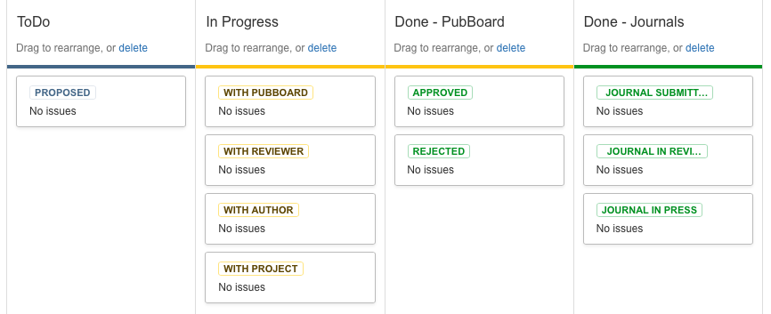

This is a SQuaRE Technical Note describing the implementation of the
LSST Publication Board process in JIRA.

Policy
======

The governing policy is http://ls.st/LPM-162 - this document is only
an implementation specification for the workflow of the publication
board.

Workflow
========

The following workflow statuses are available. By request, the workflow
is not constrained, i.e. one can transition from and to any status from
any other status.

Note that we use the words "paper" and "journal" for the thing that is
submitted and its eventual publication destination, by convention and
because they are expected to dominate usage, but these are general
terms for "artifact that is subject to the PubBoard" and "eventual
publication outlet".

Here is the Kanban board view of the statuses allowed by the workflow:

A definition of those steps follows. 

Todo statuses
-----------

This is the status (aka New) that a newly created story has.

Proposed
    A paper (or other artifact) has been submitted to the PubBoard

In Progress statuses (PubBoard)
-----------------------------

With PubBoard
    Awaiting Action from the PubBoard (referee assignment, approval etc)
With Reviewer
    The paper is with the reviewer assigned by the pub board
With Author
    The paper is with the author (eg. for edits)
With Project
    The paper is in its project-wide consultation period

Depending on the extent of comments received, a paper may transition
several times between these statuses. For example it may bounce between
the author and reviewer several times as comments are made and
addressed.

Done Statuses - Pub Board
-------------------------

Approved
    The paper has been approved by the PubBoard for publication

Rejected
    The paper has failed to clear the PubBoard process

Done statuses (Journals)
-----------------------------

The following statuses can be used to track the paper after it has
exited the PubBoard process if the author, LSST Communications or LSST
subsystem cares to do so. However, they are non-actionable statuses by
the PubBoard and therefore JIRA treats them as resolved. 

Journal Submitted
    The paper has been submitted to the journal (or proceedings etc.)
Journal In Review
    The paper is in the journal's peer review process
Journal In Press
    The paper has been accepted and has a publication reference

Issue Types
===========

The PubBoard has the following Issue Type:

Paper
    An artefact subject to PubBoard publication policy

Custom Fields
=============

In general the reporter of the ticket is the person dealing with the
PubBoard (typically the lead author) and the description field serves
as an abstract. The reviewer is as with code review, the person
assigned for internal evaluation of the paper. 

The following issue fields are introduced or have special meaning for
PubBoard stories:

Bibcode
    Lookup referenace to citable entry (typically ADS)

Peer-reviewed
    Whether this counts as a peer-reviewed publication for our metrics
	
Subsystem
    An LSST subsystem if one is clearly identified with this publication

Swimlanes
=========

Swimlanes have been configured to display per assigne, and
unassigned. This should help figure out if any particular reviewer is
a bottleneck.

Links
=====

- `JIRA Pub Board project <https://jira.lsstcorp.org/secure/RapidBoard.jspa?rapidView=92&projectKey=PUB>`_

  The JIRA Project described in this note
  
- `SQuaRE Technical Note <http://sqr-005.readthedocs.org/en/latest/>`_

  Online version of this document
  
- `SQuaRE Technical Note <https://github.com/lsst-sqre/sqr-005>`_

  The source repository for this note. PR corrections/additions. 

